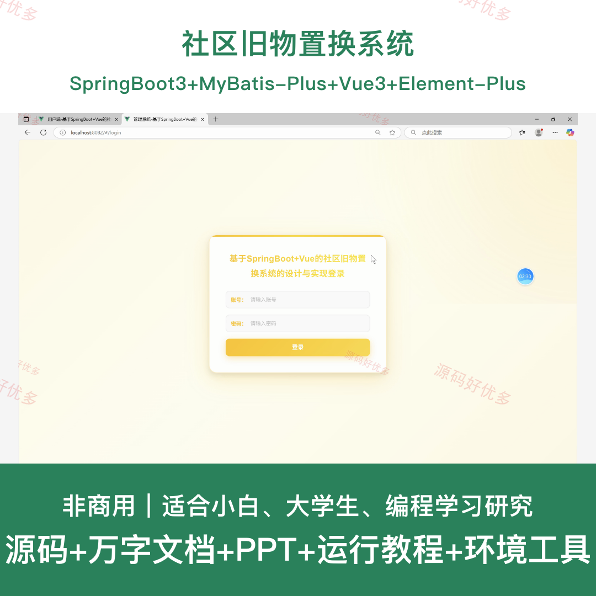
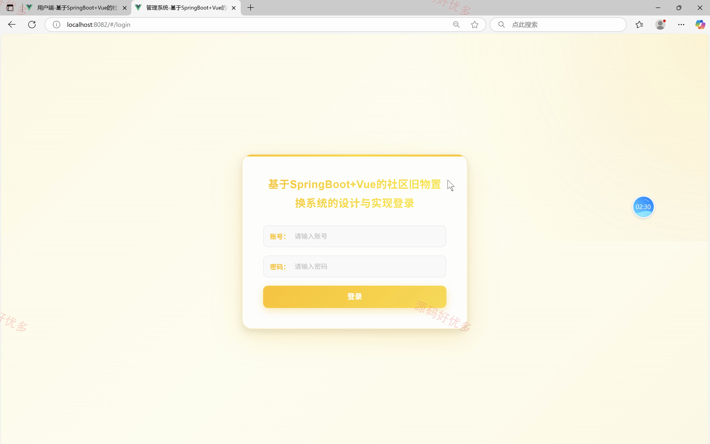
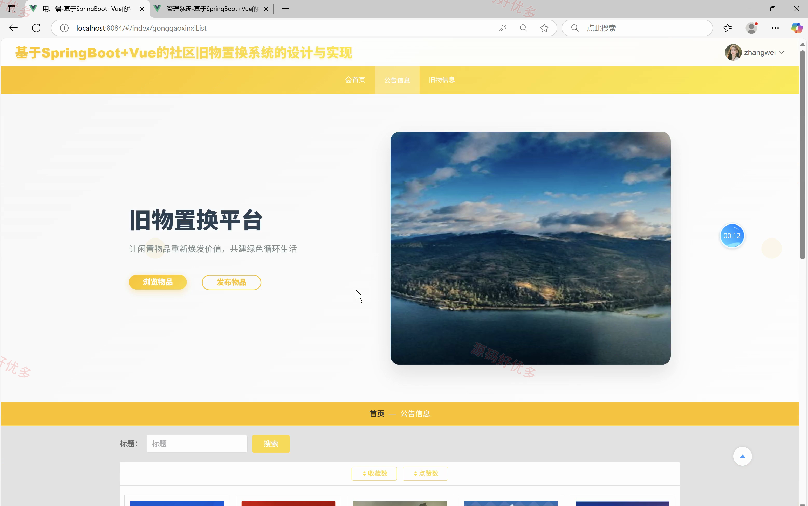
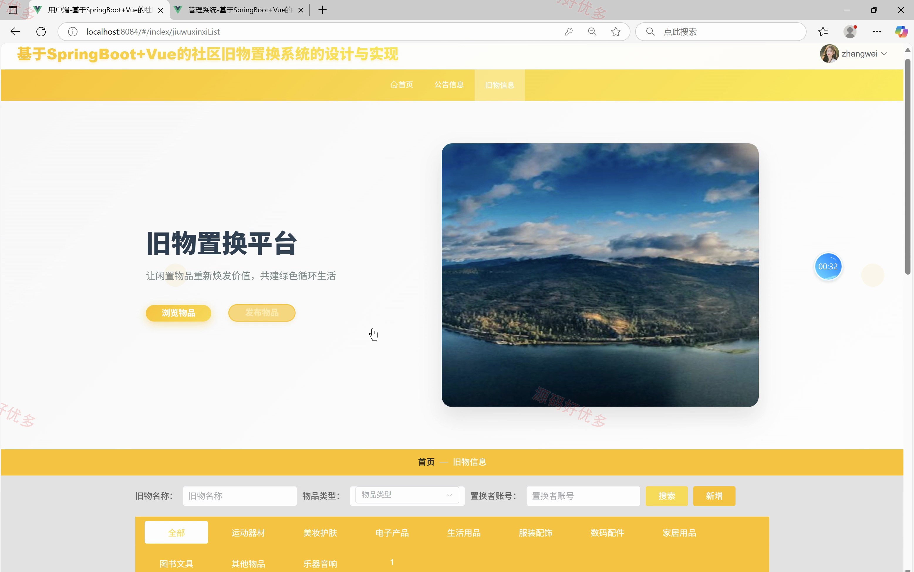
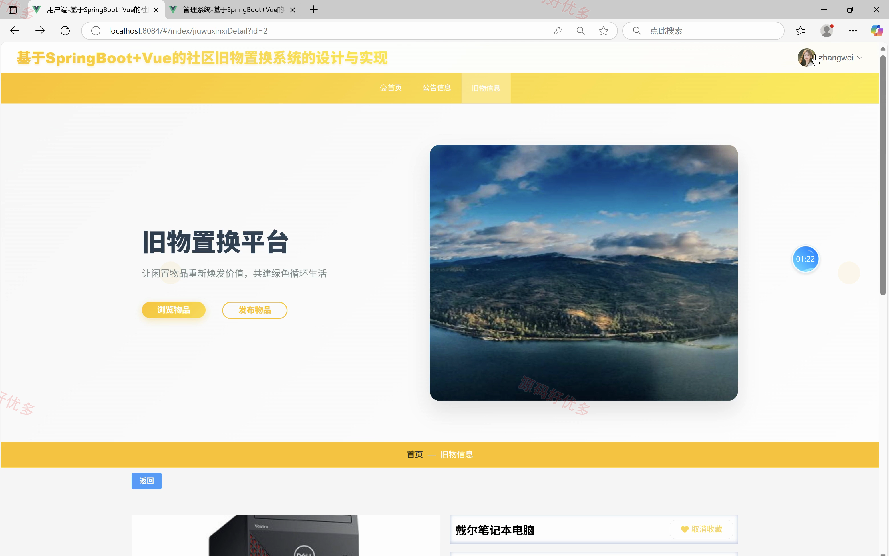
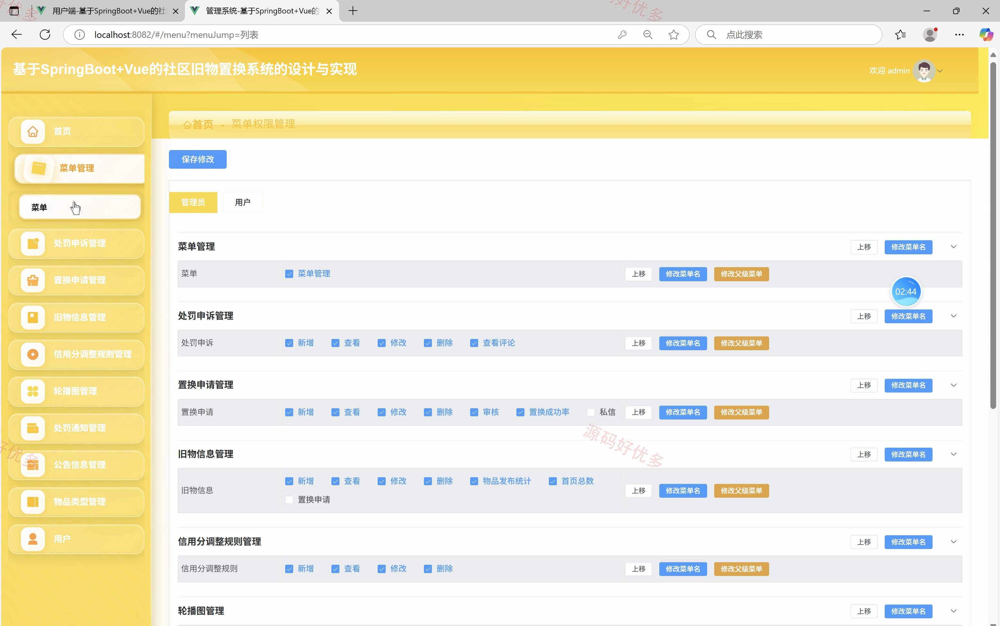
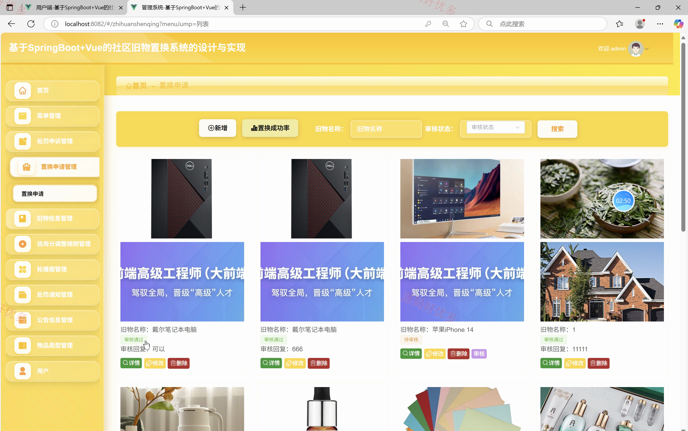
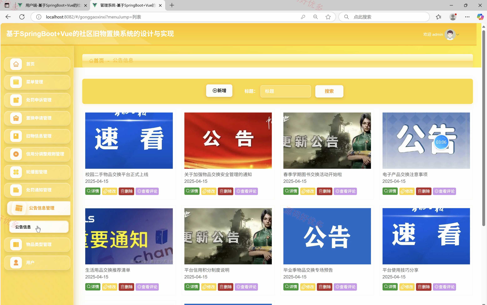
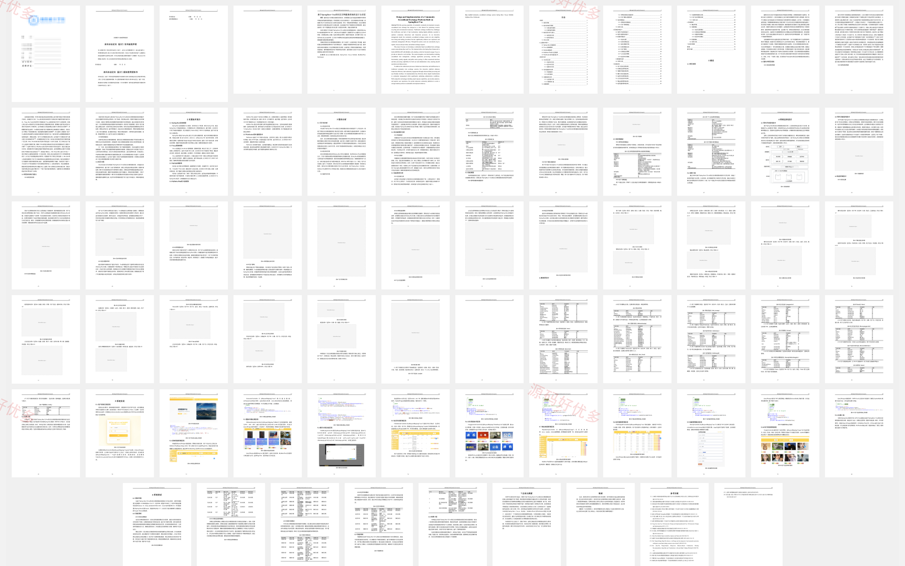

## 源码问题查看主页咨询

### 一、关键词
社区旧物置换系统、社区旧物置换、社区旧物置换信息管理、社区旧物置换后台管理

### 二、作品包含
源码+数据库+万字设计文档+PPT+全套环境和工具资源+本地部署教程

### 三、项目技术
前端技术： Html、Css、Js、Vue3.2、Element-Plus
后端技术：Java、SpringBoot3.3.0、MyBatis-Plus

### 四、运行环境（以下版本亲测，其他版本兼容性请自行测试）
开发工具：IDEA/eclipse + VSCODE

数据库：MySQL8.0+（共17张表）

数据库管理工具：Navicat10以上版本

环境配置软件： JDK17 + Maven3.6.3

前端Nodejs：16+

浏览器：谷歌浏览器

### 五、项目介绍
项目编号：springbootA617D

社区旧物置换系统面向管理员、用户，提供处罚申诉管理、置换申请管理、旧物信息管理、信用分调整规则管理、轮播图管理、处罚通知管理、公告信息管理等功能，实现各角色在系统中的实际业务协作。

角色：管理员、用户

管理员功能：后台登录、旧物与物品类型管理、置换申请审核、用户与信用分管理、处罚通知与申诉管理、公告信息管理、轮播图管理、菜单权限管理。

用户功能：前台登录与注册、旧物发布与管理、置换申请与审核、用户私信沟通、处罚申诉与通知查看、公告浏览与互动、我的收藏管理、个人中心维护。

### 六、运行截图

